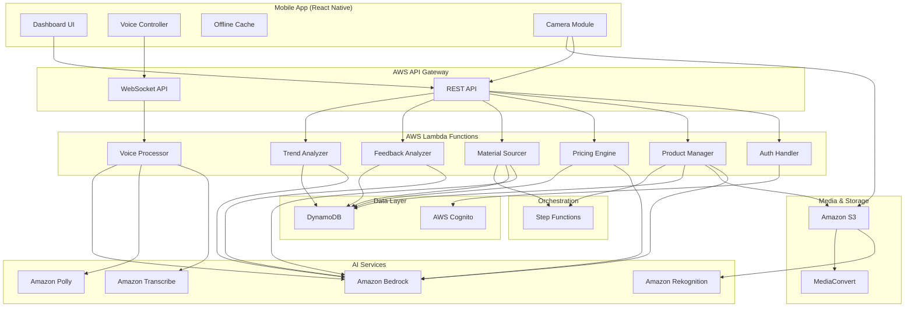

# Design Document: KalaManager AI

## Overview

KalaManager AI is a voice-first mobile application that empowers rural Indian artisans to manage their craft businesses autonomously. The system uses AWS cloud services to provide intelligent pricing, product listing, material sourcing, and business analytics through natural voice interactions in regional dialects.

The architecture follows a serverless, event-driven design optimized for low-resource mobile devices with intermittent connectivity. The system prioritizes voice interaction over visual UI, with offline-first capabilities for critical features.

## Architecture

### High-Level Architecture



### Component Architecture

The system is divided into the following major components:

1. **Mobile Application Layer**: React Native app with offline-first architecture
2. **API Gateway Layer**: REST and WebSocket endpoints for synchronous and real-time communication
3. **Lambda Function Layer**: Serverless compute for business logic
4. **AI Services Layer**: AWS AI/ML services for voice, vision, and intelligence
5. **Data Layer**: DynamoDB for NoSQL storage, S3 for media, Cognito for auth
6. **Orchestration Layer**: Step Functions for complex multi-step workflows

## Components and Interfaces

### 1. Mobile Application

**Technology**: React Native (cross-platform iOS/Android)

**Sub-components**:

- **Voice Controller**: Manages wake word detection, audio recording, and playback
- **Dashboard UI**: Displays earnings, orders, inventory with large touch targets
- **Offline Cache**: Local SQLite database for offline data access
- **Camera Module**: Handles photo capture with quality guidance
- **Sync Manager**: Handles background data synchronization

**Key Interfaces**:

```typescript
interface VoiceController {
  startListening(wakeWord: string): void
  stopListening(): void
  sendAudioStream(audioData: Blob): Promise<TranscriptionResult>
  playResponse(audioUrl: string): void
}

interface DashboardData {
  dailyEarnings: number
  salesCount: number
  pendingOrders: Order[]
  inventoryStatus: InventoryItem[]
  trendingCrafts: Trend[]
}

interface OfflineCache {
  saveDashboardData(data: DashboardData): void
  getDashboardData(): DashboardData | null
  queueVoiceCommand(command: VoiceCommand): void
  getPendingCommands(): VoiceCommand[]
  clearSyncedCommands(commandIds: string[]): void
}
```

### 2. Voice Processing Pipeline

**Components**: Voice Processor Lambda, Amazon Transcribe, Amazon Polly, Amazon Bedrock

**Flow**:
1. Mobile app streams audio to WebSocket API
2. Voice Processor Lambda receives audio chunks
3. Transcribe converts speech to text (dialect-aware)
4. Bedrock processes intent and generates response
5. Polly converts response text to speech
6. Audio response streamed back to mobile app

**Interfaces**:

```python
class VoiceProcessor:
    def process_audio_stream(
        self,
        audio_stream: bytes,
        language_code: str,
        session_id: str
    ) -> VoiceResponse:
        """
        Process incoming audio stream and return voice response.
        
        Args:
            audio_stream: Raw audio bytes in PCM format
            language_code: Language/dialect code (hi-IN, ta-IN, etc.)
            session_id: User session identifier for context
            
        Returns:
            VoiceResponse with transcription, intent, and audio response
        """
        pass
    
    def extract_product_info(
        self,
        transcription: str,
        context: ConversationContext
    ) -> ProductInfo:
        """
        Extract structured product information from transcription.
        Uses Bedrock to identify: material, category, dimensions, colors, story.
        """
        pass
    
    def generate_clarifying_question(
        self,
        incomplete_info: ProductInfo
    ) -> str:
        """
        Generate natural language question for missing product details.
        """
        pass
```

### 3. Product Listing Manager

**Component**: Product Manager Lambda

**Responsibilities**:
- Create marketplace-ready product listings
- Validate required fields
- Store product data in DynamoDB
- Trigger pricing analysis
- Prepare ONDC-compatible format

**Interfaces**:

```python
class ProductManager:
    def create_listing(
        self,
        artisan_id: str,
        product_info: ProductInfo,
        images: List[str]
    ) -> ProductListing:
        """
        Create a complete product listing from extracted information.
        
        Args:
            artisan_id: Unique identifier for the artisan
            product_info: Structured product information
            images: S3 URLs of product images
            
        Returns:
            Complete ProductListing with generated ID
        """
        pass
    
    def validate_listing(
        self,
        listing: ProductListing
    ) -> ValidationResult:
        """
        Validate listing has all required fields for marketplace.
        """
        pass
    
    def export_to_ondc(
        self,
        listing: ProductListing
    ) -> dict:
        """
        Convert internal listing format to ONDC protocol format.
        """
        pass
```

**Data Model**:

```python
@dataclass
class ProductListing:
    product_id: str
    artisan_id: str
    title: str
    description: str
    category: str
    material: str
    dimensions: Dict[str, float]  # length, width, height
    colors: List[str]
    craft_story: str
    images: List[str]  # S3 URLs
    price: float
    currency: str
    created_at: datetime
    updated_at: datetime
    marketplace_ids: Dict[str, str]  # marketplace_name -> external_id
    status: str  # draft, active, sold, archived
```

### 4. Pricing Intelligence Engine

**Component**: Pricing Engine Lambda

**Responsibilities**:
- Research market prices using Bedrock web search
- Analyze competitor pricing
- Calculate material and labor costs
- Generate price recommendations with reasoning

**Interfaces**:

```python
class PricingEngine:
    def analyze_market(
        self,
        product_info: ProductInfo
    ) -> MarketAnalysis:
        """
        Research current market prices for similar products.
        Uses Bedrock with web search to find comparable items.
        
        Returns:
            MarketAnalysis with price range, competitors, demand indicators
        """
        pass
    
    def calculate_recommendation(
        self,
        market_analysis: MarketAnalysis,
        material_costs: float,
        labor_hours: float
    ) -> PriceRecommendation:
        """
        Generate price recommendation based on market and costs.
        
        Returns:
            PriceRecommendation with suggested price, range, and reasoning
        """
        pass
    
    def generate_explanation(
        self,
        recommendation: PriceRecommendation,
        language: str
    ) -> str:
        """
        Create natural language explanation of pricing in artisan's language.
        """
        pass
```

**Data Model**:

```python
@dataclass
class PriceRecommendation:
    recommended_price: float
    price_range: Tuple[float, float]  # min, max
    reasoning: str
    market_average: float
    competitor_prices: List[float]
    confidence_score: float  # 0-1
    factors: Dict[str, Any]  # material_cost, labor_cost, demand, etc.
```

### 5. Media Processing Pipeline

**Components**: MediaConvert, Rekognition, S3

**Flow**:
1. Artisan uploads photos to S3 via mobile app
2. Rekognition assesses image quality
3. If quality insufficient, provide voice guidance
4. MediaConvert generates marketing reel
5. Add overlays, transitions, music
6. Store final video in S3

**Interfaces**:

```python
class MediaProcessor:
    def assess_image_quality(
        self,
        image_url: str
    ) -> ImageQualityAssessment:
        """
        Use Rekognition to evaluate image quality.
        Checks: brightness, sharpness, composition, object detection.
        
        Returns:
            Assessment with quality score and improvement suggestions
        """
        pass
    
    def generate_quality_guidance(
        self,
        assessment: ImageQualityAssessment,
        language: str
    ) -> str:
        """
        Create voice guidance for improving photo quality.
        """
        pass
    
    def create_marketing_reel(
        self,
        images: List[str],
        product_info: ProductInfo
    ) -> str:
        """
        Generate marketing video using MediaConvert.
        
        Args:
            images: S3 URLs of product photos (3-10 images)
            product_info: Product details for text overlays
            
        Returns:
            S3 URL of generated video
        """
        pass
```

**MediaConvert Job Configuration**:

```json
{
  "inputs": [
    {
      "imageInserter": {
        "insertableImages": [
          {
            "imageX": 0,
            "imageY": 0,
            "layer": 0,
            "imageInserterInput": "s3://bucket/image1.jpg",
            "duration": 3000
          }
        ]
      }
    }
  ],
  "outputGroups": [
    {
      "outputs": [
        {
          "videoDescription": {
            "width": 1080,
            "height": 1920,
            "codecSettings": {
              "codec": "H_264"
            }
          },
          "audioDescriptions": [
            {
              "audioSourceName": "background_music"
            }
          ]
        }
      ]
    }
  ]
}
```

### 6. Material Sourcing Engine

**Component**: Material Sourcer Lambda

**Responsibilities**:
- Search supplier websites for material prices
- Compare prices across suppliers
- Facilitate purchase through supplier APIs
- Track inventory levels
- Generate low-stock warnings

**Interfaces**:

```python
class MaterialSourcer:
    def search_suppliers(
        self,
        material_name: str,
        quantity: float,
        unit: str
    ) -> List[SupplierQuote]:
        """
        Search multiple suppliers for material prices.
        Uses Bedrock web search to find current prices.
        
        Returns:
            List of SupplierQuote objects sorted by price
        """
        pass
    
    def generate_comparison_summary(
        self,
        quotes: List[SupplierQuote],
        language: str
    ) -> str:
        """
        Create voice summary of price comparison.
        """
        pass
    
    def initiate_purchase(
        self,
        artisan_id: str,
        quote: SupplierQuote
    ) -> PurchaseOrder:
        """
        Create purchase order and call supplier API.
        """
        pass
    
    def update_inventory(
        self,
        artisan_id: str,
        material: str,
        quantity_change: float
    ) -> InventoryItem:
        """
        Update inventory levels after purchase or usage.
        """
        pass
    
    def check_low_stock(
        self,
        artisan_id: str
    ) -> List[InventoryAlert]:
        """
        Check all materials for low stock conditions.
        Returns alerts for items below 20% threshold.
        """
        pass
```

**Data Model**:

```python
@dataclass
class InventoryItem:
    artisan_id: str
    material_name: str
    current_quantity: float
    unit: str
    typical_usage_rate: float  # per week
    reorder_threshold: float  # 20% of typical stock
    last_updated: datetime
    supplier_preference: str

@dataclass
class SupplierQuote:
    supplier_name: str
    material_name: str
    price_per_unit: float
    minimum_quantity: float
    delivery_time_days: int
    supplier_rating: float
    api_endpoint: str
```

### 7. Dashboard Manager

**Component**: Dashboard UI + Dashboard Lambda

**Responsibilities**:
- Aggregate daily earnings and sales
- Calculate order feasibility
- Display inventory status
- Show trending crafts
- Support voice navigation

**Interfaces**:

```python
class DashboardManager:
    def get_dashboard_data(
        self,
        artisan_id: str,
        date: datetime
    ) -> DashboardData:
        """
        Aggregate all dashboard metrics for specified date.
        """
        pass
    
    def calculate_order_feasibility(
        self,
        order: Order,
        inventory: List[InventoryItem]
    ) -> FeasibilityStatus:
        """
        Determine if order can be fulfilled with current materials.
        
        Returns:
            FeasibilityStatus: FEASIBLE, AT_RISK, or UNFEASIBLE
        """
        pass
    
    def get_material_requirements(
        self,
        order: Order
    ) -> Dict[str, float]:
        """
        Calculate materials needed for an order.
        """
        pass
```

**Data Model**:

```python
@dataclass
class DashboardData:
    artisan_id: str
    date: datetime
    daily_earnings: float
    sales_count: int
    pending_orders: List[OrderSummary]
    inventory_status: List[InventoryItem]
    trending_crafts: List[Trend]
    low_stock_alerts: List[InventoryAlert]

@dataclass
class OrderSummary:
    order_id: str
    product_name: str
    buyer_name: str
    amount: float
    order_date: datetime
    feasibility: str  # FEASIBLE, AT_RISK, UNFEASIBLE
    missing_materials: List[str]
```

### 8. Feedback Analysis Engine

**Component**: Feedback Analyzer Lambda

**Responsibilities**:
- Collect reviews from marketplaces
- Perform sentiment analysis
- Identify common themes
- Generate spoken report cards

**Interfaces**:

```python
class FeedbackAnalyzer:
    def collect_reviews(
        self,
        artisan_id: str,
        marketplace: str
    ) -> List[Review]:
        """
        Fetch reviews from marketplace API.
        """
        pass
    
    def analyze_sentiment(
        self,
        reviews: List[Review]
    ) -> SentimentAnalysis:
        """
        Use Bedrock to classify sentiment and extract themes.
        
        Returns:
            SentimentAnalysis with positive/neutral/negative counts and themes
        """
        pass
    
    def generate_report_card(
        self,
        analysis: SentimentAnalysis,
        language: str
    ) -> str:
        """
        Create spoken summary of feedback in artisan's language.
        Example: "10 customers this week. 8 loved quality. 2 said delivery was slow."
        """
        pass
```

**Data Model**:

```python
@dataclass
class SentimentAnalysis:
    total_reviews: int
    positive_count: int
    neutral_count: int
    negative_count: int
    themes: Dict[str, int]  # theme -> mention count
    common_praises: List[str]
    common_complaints: List[str]
    average_rating: float
    week_start: datetime
    week_end: datetime
```

### 9. Trend Analysis Engine

**Component**: Trend Analyzer Lambda

**Responsibilities**:
- Monitor marketplace trends
- Identify popular craft categories
- Match trends to artisan skills
- Provide material and technique guidance

**Interfaces**:

```python
class TrendAnalyzer:
    def discover_trends(
        self,
        region: str
    ) -> List[Trend]:
        """
        Use Bedrock web search to identify trending craft categories.
        Analyzes: sales volume, search frequency, seasonal patterns.
        """
        pass
    
    def match_to_artisan(
        self,
        trends: List[Trend],
        artisan_profile: ArtisanProfile
    ) -> List[TrendRecommendation]:
        """
        Filter and rank trends based on artisan's skills and materials.
        """
        pass
    
    def generate_trend_guidance(
        self,
        trend: Trend,
        language: str
    ) -> TrendGuidance:
        """
        Create guidance on materials and techniques for a trend.
        """
        pass
```

**Data Model**:

```python
@dataclass
class Trend:
    trend_id: str
    category: str
    description: str
    popularity_score: float  # 0-100
    growth_rate: float  # percentage
    example_products: List[str]  # URLs
    average_price_range: Tuple[float, float]
    seasonal: bool
    peak_months: List[int]
    discovered_at: datetime

@dataclass
class TrendRecommendation:
    trend: Trend
    match_score: float  # 0-1
    required_materials: List[str]
    required_skills: List[str]
    learning_resources: List[str]
    estimated_startup_cost: float
```

### 10. Authentication Service

**Component**: Auth Handler Lambda + AWS Cognito

**Responsibilities**:
- OTP generation and validation
- Session management
- Phone number verification

**Interfaces**:

```python
class AuthService:
    def send_otp(
        self,
        phone_number: str
    ) -> OTPResponse:
        """
        Generate and send 6-digit OTP via SMS.
        OTP valid for 10 minutes.
        """
        pass
    
    def verify_otp(
        self,
        phone_number: str,
        otp: str
    ) -> AuthToken:
        """
        Verify OTP and create 30-day session.
        Allows 3 retry attempts.
        """
        pass
    
    def refresh_session(
        self,
        refresh_token: str
    ) -> AuthToken:
        """
        Refresh authentication token.
        """
        pass
```

## Data Models

### DynamoDB Table Design

**Table 1: Artisans**
- Partition Key: `artisan_id` (string)
- Attributes: phone_number, name, language_preference, skills, location, created_at

**Table 2: Products**
- Partition Key: `product_id` (string)
- Sort Key: `artisan_id` (string)
- GSI: artisan_id-created_at-index
- Attributes: All ProductListing fields

**Table 3: Orders**
- Partition Key: `order_id` (string)
- Sort Key: `artisan_id` (string)
- GSI: artisan_id-order_date-index
- Attributes: product_id, buyer_info, amount, status, order_date, fulfillment_status

**Table 4: Inventory**
- Partition Key: `artisan_id` (string)
- Sort Key: `material_name` (string)
- Attributes: All InventoryItem fields

**Table 5: Reviews**
- Partition Key: `artisan_id` (string)
- Sort Key: `review_date` (string)
- Attributes: order_id, rating, comment, sentiment, marketplace, analyzed

**Table 6: Trends**
- Partition Key: `trend_id` (string)
- Sort Key: `discovered_at` (string)
- GSI: category-popularity_score-index
- Attributes: All Trend fields

**Table 7: VoiceCommands** (for offline sync)
- Partition Key: `artisan_id` (string)
- Sort Key: `timestamp` (string)
- Attributes: command_type, audio_url, transcription, processed, created_at

## Correctness Properties

*A property is a characteristic or behavior that should hold true across all valid executions of a system—essentially, a formal statement about what the system should do. Properties serve as the bridge between human-readable specifications and machine-verifiable correctness guarantees.*


### Voice Interaction Properties

Property 1: Wake word activation
*For any* audio stream, the Voice_Agent should only activate when the wake word "Kalakaar" is detected, and should not activate for audio without the wake word.
**Validates: Requirements 1.1**

Property 2: Multilingual transcription accuracy
*For any* spoken phrase in Hindi, English, Tamil, Telugu, Bengali, or Marathi, the Transcription_Service should convert it to text that preserves the semantic meaning of the original speech.
**Validates: Requirements 1.2, 7.2**

Property 3: Product information extraction completeness
*For any* product description transcription, the Intelligence_Engine should extract all present information about material, category, craft story, dimensions, and colors when mentioned in the description.
**Validates: Requirements 1.3**

Property 4: Clarifying question generation
*For any* incomplete product information, the Intelligence_Engine should generate a natural language clarifying question that addresses the missing fields.
**Validates: Requirements 1.4**

Property 5: Product listing persistence
*For any* complete product information, creating a Product_Listing should result in the data being persisted to DynamoDB within 3 seconds.
**Validates: Requirements 1.6**

### Pricing Intelligence Properties

Property 6: Market price research completeness
*For any* product category and material combination, the Pricing_Analyzer should return at least 3 comparable market prices from web search results.
**Validates: Requirements 2.1**

Property 7: Price recommendation accuracy
*For any* product with known market prices, the recommended price should be within 10% of the actual market average for similar products.
**Validates: Requirements 2.6**

Property 8: Pricing explanation generation
*For any* price recommendation, the system should generate a natural language explanation in the artisan's selected language that includes reasoning factors.
**Validates: Requirements 2.4**

Property 9: Price modification persistence
*For any* artisan-modified price, the final price should be persisted to the Product_Listing and override the recommended price.
**Validates: Requirements 2.7**

### Media Processing Properties

Property 10: Image quality assessment
*For any* uploaded product photo, the Image_Assessor should evaluate brightness, focus, and composition and return a quality score.
**Validates: Requirements 3.1**

Property 11: Quality guidance generation
*For any* photo with quality score below threshold, the system should generate spoken guidance in the artisan's language with specific improvement suggestions.
**Validates: Requirements 3.2**

Property 12: Video generation from photos
*For any* set of 3-10 acceptable quality photos, the Media_Processor should generate a marketing video with transitions, overlays, and background music within 60 seconds.
**Validates: Requirements 3.3, 3.6, 3.7**

Property 13: Video format optimization
*For any* generated marketing video, the output format should be compatible with standard marketplace advertisement specifications (1080x1920, H.264).
**Validates: Requirements 3.5**

### Material Sourcing Properties

Property 14: Multi-supplier price search
*For any* material name and quantity, the Material_Sourcer should return price quotes from at least 3 different suppliers.
**Validates: Requirements 4.2**

Property 15: Price comparison summary generation
*For any* set of supplier quotes, the system should generate a spoken comparison summary in the artisan's language that includes prices and delivery times.
**Validates: Requirements 4.3**

Property 16: Inventory update on purchase
*For any* completed material purchase, the system should update the artisan's Inventory records with the new quantity within 5 seconds.
**Validates: Requirements 4.5**

Property 17: Low stock detection
*For any* material in inventory, when the current quantity falls below 20% of typical usage rate, the system should generate an early warning notification.
**Validates: Requirements 4.7**

### Dashboard Properties

Property 18: Dashboard data aggregation
*For any* artisan and date, the Dashboard should display accurate daily earnings calculated from all completed orders for that date.
**Validates: Requirements 5.1, 5.2**

Property 19: Order feasibility calculation
*For any* pending order and current inventory state, the system should correctly classify the order as feasible (green), at-risk (yellow), or unfeasible (red) based on material availability.
**Validates: Requirements 5.4, 5.5**

Property 20: Insufficient inventory warning
*For any* pending order classified as unfeasible, the Dashboard should display an early warning message identifying the missing materials.
**Validates: Requirements 5.6**

Property 21: Voice navigation responsiveness
*For any* voice command issued to the Dashboard, the system should respond with audio feedback within 2 seconds.
**Validates: Requirements 5.8**

### Feedback Analysis Properties

Property 22: Review collection and storage
*For any* buyer review posted on a connected marketplace, the system should collect and persist the feedback to DynamoDB within 24 hours.
**Validates: Requirements 6.1**

Property 23: Sentiment classification
*For any* collected review, the Feedback_Analyzer should classify it as positive, neutral, or negative using sentiment analysis.
**Validates: Requirements 6.2**

Property 24: Theme extraction
*For any* set of reviews, the Feedback_Analyzer should identify common themes (quality, delivery, packaging) and their frequency counts.
**Validates: Requirements 6.3**

Property 25: Report card generation
*For any* artisan's weekly reviews, the system should generate a spoken summary in their dialect that includes total count, positive count, and key improvement areas.
**Validates: Requirements 6.4, 6.5**

Property 26: Critical feedback notification
*For any* review classified as critically negative, the system should notify the artisan within 24 hours of collection.
**Validates: Requirements 6.7**

### Multilingual Support Properties

Property 27: Language consistency across interfaces
*For any* selected language preference (Hindi, English, Tamil, Telugu, Bengali, Marathi), all UI text and voice responses should be rendered in that language.
**Validates: Requirements 7.1, 7.2, 7.3**

Property 28: Language preference persistence
*For any* artisan's language selection, the preference should be persisted and applied across all future sessions until changed.
**Validates: Requirements 7.7**

Property 29: Mid-session language switching
*For any* language change during an active session, the Voice_Agent should maintain conversation context and continue the interaction in the new language.
**Validates: Requirements 7.5**

### Offline Capability Properties

Property 30: Offline dashboard access
*For any* cached dashboard data, when internet connectivity is unavailable, the system should display the most recent cached data with an offline indicator.
**Validates: Requirements 8.1, 8.3, 8.5**

Property 31: Offline voice recording
*For any* voice command recorded while offline, the system should store the audio locally and automatically sync it when connectivity is restored.
**Validates: Requirements 8.2, 8.4**

Property 32: Offline feature limitation feedback
*For any* feature requiring internet access when offline, the system should provide clear voice feedback explaining the limitation.
**Validates: Requirements 8.6**

### Order Fulfillment Properties

Property 33: Material requirement calculation
*For any* received order, the system should calculate the required materials based on the product specification and compare against current inventory.
**Validates: Requirements 11.1, 11.2**

Property 34: Order feasibility classification
*For any* order and inventory state, the system should classify the order as feasible (all materials available), at-risk (materials below 30%), or unfeasible (materials insufficient).
**Validates: Requirements 11.3**

Property 35: Material deduction on completion
*For any* order marked as completed, the system should automatically deduct the used materials from inventory records.
**Validates: Requirements 11.7**

Property 36: Missing material identification
*For any* unfeasible order, the system should identify and list the specific materials that are insufficient.
**Validates: Requirements 11.4**

### Trend Discovery Properties

Property 37: Trend identification from marketplace data
*For any* trend search request, the Intelligence_Engine should analyze marketplace data and return trending craft categories based on sales volume and search frequency.
**Validates: Requirements 12.1, 12.2**

Property 38: Trend presentation in artisan's language
*For any* identified trend, the Voice_Agent should present it as a spoken suggestion in the artisan's selected dialect with examples.
**Validates: Requirements 12.3, 12.4**

Property 39: Trend guidance generation
*For any* trend that an artisan expresses interest in, the system should provide guidance on required materials and techniques.
**Validates: Requirements 12.5**

Property 40: Skill-matched trend prioritization
*For any* set of identified trends, the system should prioritize trends that match the artisan's existing skills and available materials.
**Validates: Requirements 12.7**

### Authentication Properties

Property 41: OTP generation and delivery
*For any* valid phone number, the Authentication_Service should generate a 6-digit OTP and deliver it via SMS within 30 seconds.
**Validates: Requirements 10.2**

Property 42: OTP validation with retry limit
*For any* OTP validation attempt, the system should allow up to 3 incorrect attempts before requiring a new OTP generation.
**Validates: Requirements 10.6**

Property 43: Session persistence
*For any* successful OTP validation, the system should create an authenticated session that remains valid for 30 days.
**Validates: Requirements 10.5**

### Marketplace Integration Properties

Property 44: Product listing field completeness
*For any* Product_Listing, all required fields (images, description, price, dimensions, materials, category) should be present before allowing marketplace export.
**Validates: Requirements 13.3, 13.6**

Property 45: ONDC format export
*For any* complete Product_Listing, the system should be able to export the data in JSON format compatible with ONDC protocol structure.
**Validates: Requirements 13.2, 13.4**

Property 46: Marketplace ID mapping
*For any* product published to an external marketplace, the system should maintain a bidirectional mapping between internal product_id and external marketplace_id.
**Validates: Requirements 13.7**

## Error Handling

### Voice Processing Errors

**Scenario**: Wake word not detected or false positive
- **Handling**: Require 2-second continuous audio match before activation
- **User Feedback**: Audio confirmation tone only on successful activation
- **Recovery**: Automatic reset after 30 seconds of silence

**Scenario**: Transcription fails or returns empty text
- **Handling**: Request artisan to repeat the command
- **User Feedback**: Voice message: "I didn't catch that. Please say it again."
- **Recovery**: Allow 3 retry attempts before suggesting text input fallback

**Scenario**: Unsupported dialect or language detected
- **Handling**: Default to English transcription, log language code
- **User Feedback**: Voice message: "I'm having trouble understanding. Can you try in [supported language]?"
- **Recovery**: Offer language selection menu

**Scenario**: Network timeout during audio streaming
- **Handling**: Save audio locally, queue for retry
- **User Feedback**: Voice message: "Connection issue. I'll process this when online."
- **Recovery**: Automatic retry with exponential backoff (5s, 15s, 45s)

### Product Listing Errors

**Scenario**: Incomplete product information after 5 clarifying questions
- **Handling**: Save partial listing as draft
- **User Feedback**: Voice message: "I've saved what we have. You can complete this later."
- **Recovery**: Allow resuming draft listings from dashboard

**Scenario**: Image upload fails due to size or format
- **Handling**: Compress image on device before retry
- **User Feedback**: Voice message: "Photo is too large. Compressing and trying again."
- **Recovery**: Automatic compression to 2MB max, convert to JPEG

**Scenario**: DynamoDB write fails
- **Handling**: Queue write operation for retry
- **User Feedback**: Voice message: "Saving your product. This may take a moment."
- **Recovery**: Retry with exponential backoff, alert user if fails after 3 attempts

### Pricing Analysis Errors

**Scenario**: No comparable products found in market research
- **Handling**: Use category average prices as fallback
- **User Feedback**: Voice message: "I couldn't find exact matches. Here's a price based on similar crafts."
- **Recovery**: Suggest artisan provide their own price estimate

**Scenario**: Bedrock API rate limit exceeded
- **Handling**: Queue request for processing
- **User Feedback**: Voice message: "Many artisans are using the system. Your pricing will be ready in a few minutes."
- **Recovery**: Process queued requests in order, notify when complete

**Scenario**: Web search returns no results
- **Handling**: Use historical pricing data for category
- **User Feedback**: Voice message: "Using typical prices for [category] crafts."
- **Recovery**: Log for manual review, update pricing model

### Media Processing Errors

**Scenario**: All uploaded photos fail quality assessment
- **Handling**: Provide detailed voice guidance for each photo
- **User Feedback**: Voice message: "Photo 1 is too dark. Photo 2 is blurry. Let me guide you."
- **Recovery**: Step-by-step photo capture guidance with real-time feedback

**Scenario**: MediaConvert job fails
- **Handling**: Retry with simplified template (no transitions)
- **User Feedback**: Voice message: "Creating a simpler video version."
- **Recovery**: If retry fails, offer slideshow format instead

**Scenario**: Video generation exceeds 60-second timeout
- **Handling**: Continue processing, notify when complete
- **User Feedback**: Voice message: "Your video is taking longer than usual. I'll notify you when it's ready."
- **Recovery**: Send push notification on completion

### Material Sourcing Errors

**Scenario**: No suppliers found for requested material
- **Handling**: Suggest alternative material names or categories
- **User Feedback**: Voice message: "I couldn't find [material]. Did you mean [alternative]?"
- **Recovery**: Offer manual supplier entry option

**Scenario**: Supplier API returns error or timeout
- **Handling**: Skip that supplier, continue with others
- **User Feedback**: Voice message: "One supplier isn't responding. Here are the others."
- **Recovery**: Retry failed supplier in background

**Scenario**: Inventory update conflict (concurrent modifications)
- **Handling**: Use optimistic locking with retry
- **User Feedback**: Transparent to user
- **Recovery**: Automatic retry with latest inventory state

### Dashboard Errors

**Scenario**: Dashboard data load fails
- **Handling**: Display cached data with timestamp
- **User Feedback**: Visual indicator: "Showing data from [time]"
- **Recovery**: Automatic refresh attempt every 30 seconds

**Scenario**: Order feasibility calculation fails
- **Handling**: Default to "at-risk" status
- **User Feedback**: Yellow indicator with message: "Unable to verify materials"
- **Recovery**: Manual refresh option, background retry

### Feedback Analysis Errors

**Scenario**: Marketplace API unavailable
- **Handling**: Skip that marketplace, continue with others
- **User Feedback**: Dashboard note: "Some reviews may be delayed"
- **Recovery**: Retry every 6 hours

**Scenario**: Sentiment analysis returns low confidence
- **Handling**: Classify as neutral, flag for manual review
- **User Feedback**: Transparent to user
- **Recovery**: Human review queue for ambiguous reviews

### Authentication Errors

**Scenario**: SMS delivery fails
- **Handling**: Retry OTP delivery via alternative SMS provider
- **User Feedback**: Voice message: "Sending code again. Please wait."
- **Recovery**: Allow manual OTP entry if user received it

**Scenario**: Session expired
- **Handling**: Prompt for re-authentication
- **User Feedback**: Voice message: "Your session expired. Let's log you in again."
- **Recovery**: Preserve unsaved work in local storage

**Scenario**: Invalid phone number format
- **Handling**: Validate format before OTP generation
- **User Feedback**: Voice message: "That doesn't look like a valid phone number. Please try again."
- **Recovery**: Provide format example: "+91 XXXXXXXXXX"

### Offline Mode Errors

**Scenario**: Offline cache exceeds storage limit
- **Handling**: Remove oldest cached data (beyond 30 days)
- **User Feedback**: Transparent to user
- **Recovery**: Automatic cache cleanup on app start

**Scenario**: Sync fails after reconnection
- **Handling**: Retry individual failed items
- **User Feedback**: Dashboard indicator: "Syncing X items"
- **Recovery**: Manual sync trigger option

## Testing Strategy

### Dual Testing Approach

The KalaManager AI system requires both unit testing and property-based testing to ensure comprehensive correctness:

- **Unit tests**: Verify specific examples, edge cases, and error conditions
- **Property tests**: Verify universal properties across all inputs using randomized test data

Both testing approaches are complementary and necessary. Unit tests catch concrete bugs in specific scenarios, while property tests verify general correctness across a wide range of inputs.

### Property-Based Testing Configuration

**Library Selection**:
- **Python Lambda functions**: Use `hypothesis` library
- **TypeScript/JavaScript**: Use `fast-check` library
- **React Native mobile app**: Use `fast-check` library

**Test Configuration**:
- Minimum 100 iterations per property test (due to randomization)
- Each property test must reference its design document property
- Tag format: `# Feature: kalamanager-ai, Property {number}: {property_text}`

**Example Property Test (Python)**:

```python
from hypothesis import given, strategies as st
import pytest

# Feature: kalamanager-ai, Property 17: Low stock detection
@given(
    current_quantity=st.floats(min_value=0, max_value=100),
    typical_usage=st.floats(min_value=1, max_value=50)
)
def test_low_stock_detection(current_quantity, typical_usage):
    """
    For any material in inventory, when the current quantity falls below 
    20% of typical usage rate, the system should generate an early warning.
    """
    threshold = typical_usage * 0.20
    result = check_low_stock(current_quantity, typical_usage)
    
    if current_quantity < threshold:
        assert result.warning_generated == True
        assert "low stock" in result.message.lower()
    else:
        assert result.warning_generated == False
```

**Example Property Test (TypeScript)**:

```typescript
import fc from 'fast-check';

// Feature: kalamanager-ai, Property 27: Language consistency across interfaces
describe('Language consistency', () => {
  it('should render all UI elements in selected language', () => {
    fc.assert(
      fc.property(
        fc.constantFrom('hi-IN', 'en-IN', 'ta-IN', 'te-IN', 'bn-IN', 'mr-IN'),
        fc.record({
          earnings: fc.float(),
          salesCount: fc.integer(),
          orders: fc.array(fc.record({ id: fc.string(), amount: fc.float() }))
        }),
        (language, dashboardData) => {
          const rendered = renderDashboard(dashboardData, language);
          
          // All text should be in the selected language
          const textElements = extractTextElements(rendered);
          textElements.forEach(text => {
            expect(isInLanguage(text, language)).toBe(true);
          });
        }
      ),
      { numRuns: 100 }
    );
  });
});
```

### Unit Testing Strategy

**Focus Areas for Unit Tests**:

1. **Specific Examples**: Test concrete scenarios with known inputs/outputs
2. **Edge Cases**: Test boundary conditions (empty strings, zero values, maximum limits)
3. **Error Conditions**: Test error handling paths and recovery mechanisms
4. **Integration Points**: Test component interactions and API contracts

**Unit Test Balance**:
- Avoid writing too many unit tests for scenarios covered by property tests
- Focus unit tests on specific examples that demonstrate correct behavior
- Use unit tests for integration testing between components
- Property tests handle comprehensive input coverage

**Example Unit Test**:

```python
def test_otp_validation_retry_limit():
    """Test that OTP validation allows exactly 3 retry attempts."""
    auth_service = AuthService()
    phone = "+919876543210"
    
    # Generate OTP
    otp_response = auth_service.send_otp(phone)
    
    # Try wrong OTP 3 times
    for i in range(3):
        result = auth_service.verify_otp(phone, "000000")
        assert result.success == False
        assert result.attempts_remaining == 2 - i
    
    # 4th attempt should require new OTP
    result = auth_service.verify_otp(phone, "000000")
    assert result.success == False
    assert result.error == "MAX_ATTEMPTS_EXCEEDED"
    assert result.requires_new_otp == True
```

### Integration Testing

**Test Scenarios**:

1. **End-to-End Product Listing Flow**:
   - Wake word → transcription → extraction → clarification → listing creation
   - Verify data persisted correctly in DynamoDB
   - Verify pricing analysis triggered

2. **Material Sourcing to Inventory Update**:
   - Voice command → supplier search → price comparison → purchase → inventory update
   - Verify inventory levels updated correctly
   - Verify low stock warnings triggered when appropriate

3. **Order Fulfillment Workflow**:
   - Order received → material calculation → feasibility check → dashboard update
   - Verify correct feasibility classification
   - Verify missing materials identified

4. **Offline Sync Workflow**:
   - Record voice commands offline → reconnect → automatic sync
   - Verify all offline data synced correctly
   - Verify no data loss

### Performance Testing

**Load Testing Targets**:
- 100,000 concurrent artisan users
- 10,000 voice commands per minute
- 1 million product listings in database

**Performance Benchmarks**:
- Voice command response: < 2 seconds (p95)
- Dashboard load: < 3 seconds on low-end devices (p95)
- Product listing creation: < 3 minutes end-to-end (p95)
- Video generation: < 60 seconds for 3-10 photos (p95)

**Tools**:
- AWS Lambda performance monitoring
- CloudWatch metrics and alarms
- X-Ray for distributed tracing
- Load testing with Artillery or Locust

### Security Testing

**Test Areas**:
1. OTP generation randomness and uniqueness
2. Session token validation and expiration
3. Data encryption in transit (TLS)
4. Data encryption at rest (DynamoDB encryption)
5. API authentication and authorization
6. Input validation and sanitization
7. PII protection in logs and error messages

### Accessibility Testing

**Test Areas**:
1. Voice interaction for users with visual impairments
2. Large touch targets for users with motor impairments
3. High contrast mode for users with low vision
4. Screen reader compatibility
5. Voice feedback for all critical actions

### Localization Testing

**Test Areas**:
1. Verify all 6 languages render correctly
2. Verify font support for all character sets
3. Verify voice synthesis quality in all dialects
4. Verify transcription accuracy in all dialects
5. Verify cultural appropriateness of content

### Device Compatibility Testing

**Test Devices**:
- Low-end Android (3GB RAM, Android 8.0)
- Mid-range Android (4-6GB RAM, Android 10-12)
- High-end Android (8GB+ RAM, Android 13+)

**Test Conditions**:
- Poor network connectivity (2G, 3G)
- Intermittent connectivity
- Low battery mode
- Low storage space

### Monitoring and Observability

**Metrics to Track**:
- Voice command success rate
- Transcription accuracy rate
- Product listing completion rate
- Pricing recommendation acceptance rate
- Video generation success rate
- Material sourcing conversion rate
- Dashboard load time (p50, p95, p99)
- API error rates by endpoint
- Lambda cold start frequency
- DynamoDB throttling events

**Alerting Thresholds**:
- Voice command success rate < 95%
- Dashboard load time p95 > 5 seconds
- API error rate > 1%
- Lambda errors > 0.5%
- DynamoDB throttling > 10 events/minute

**Logging Strategy**:
- Structured JSON logs for all Lambda functions
- Correlation IDs for request tracing
- PII redaction in all logs
- CloudWatch Logs with 30-day retention
- Critical errors sent to SNS for immediate alerting
