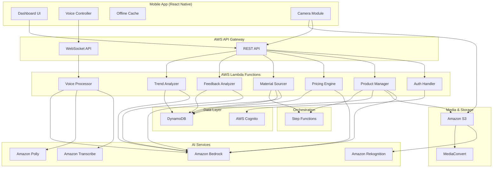

# Design Document: KalaManager AI

## Overview

KalaManager AI is a voice-first mobile application that empowers rural Indian artisans to manage their craft businesses autonomously. The system uses AWS cloud services to provide intelligent pricing, product listing, material sourcing, and business analytics through natural voice interactions in regional dialects.

The architecture follows a serverless, event-driven design optimized for low-resource mobile devices with intermittent connectivity. The system prioritizes voice interaction over visual UI, with offline-first capabilities for critical features.

## Architecture

### High-Level Architecture



### Component Architecture

The system is divided into the following major components:

1. **Mobile Application Layer**: React Native app with offline-first architecture
2. **API Gateway Layer**: REST and WebSocket endpoints for synchronous and real-time communication
3. **Lambda Function Layer**: Serverless compute for business logic
4. **AI Services Layer**: AWS AI/ML services for voice, vision, and intelligence
5. **Data Layer**: DynamoDB for NoSQL storage, S3 for media, Cognito for auth
6. **Orchestration Layer**: Step Functions for complex multi-step workflows

## Components and Interfaces

### 1. Mobile Application

**Technology**: React Native (cross-platform iOS/Android)

**Sub-components**:

- **Voice Controller**: Manages wake word detection, audio recording, and playback
- **Dashboard UI**: Displays earnings, orders, inventory with large touch targets
- **Offline Cache**: Local SQLite database for offline data access
- **Camera Module**: Handles photo capture with quality guidance
- **Sync Manager**: Handles background data synchronization

**Key Interfaces**:

```typescript
interface VoiceController {
  startListening(wakeWord: string): void
  stopListening(): void
  sendAudioStream(audioData: Blob): Promise<TranscriptionResult>
  playResponse(audioUrl: string): void
}

interface DashboardData {
  dailyEarnings: number
  salesCount: number
  pendingOrders: Order[]
  inventoryStatus: InventoryItem[]
  trendingCrafts: Trend[]
}

interface OfflineCache {
  saveDashboardData(data: DashboardData): void
  getDashboardData(): DashboardData | null
  queueVoiceCommand(command: VoiceCommand): void
  getPendingCommands(): VoiceCommand[]
  clearSyncedCommands(commandIds: string[]): void
}
```

### 2. Voice Processing Pipeline

**Components**: Voice Processor Lambda, Amazon Transcribe, Amazon Polly, Amazon Bedrock

**Flow**:
1. Mobile app streams audio to WebSocket API
2. Voice Processor Lambda receives audio chunks
3. Transcribe converts speech to text (dialect-aware)
4. Bedrock processes intent and generates response
5. Polly converts response text to speech
6. Audio response streamed back to mobile app

**Interfaces**:

```python
class VoiceProcessor:
    def process_audio_stream(
        self,
        audio_stream: bytes,
        language_code: str,
        session_id: str
    ) -> VoiceResponse:
        """
        Process incoming audio stream and return voice response.
        
        Args:
            audio_stream: Raw audio bytes in PCM format
            language_code: Language/dialect code (hi-IN, ta-IN, etc.)
            session_id: User session identifier for context
            
        Returns:
            VoiceResponse with transcription, intent, and audio response
        """
        pass
    
    def extract_product_info(
        self,
        transcription: str,
        context: ConversationContext
    ) -> ProductInfo:
        """
        Extract structured product information from transcription.
        Uses Bedrock to identify: material, category, dimensions, colors, story.
        """
        pass
    
    def generate_clarifying_question(
        self,
        incomplete_info: ProductInfo
    ) -> str:
        """
        Generate natural language question for missing product details.
        """
        pass
```

### 3. Product Listing Manager

**Component**: Product Manager Lambda

**Responsibilities**:
- Create marketplace-ready product listings
- Validate required fields
- Store product data in DynamoDB
- Trigger pricing analysis
- Prepare ONDC-compatible format

**Interfaces**:

```python
class ProductManager:
    def create_listing(
        self,
        artisan_id: str,
        product_info: ProductInfo,
        images: List[str]
    ) -> ProductListing:
        """
        Create a complete product listing from extracted information.
        
        Args:
            artisan_id: Unique identifier for the artisan
            product_info: Structured product information
            images: S3 URLs of product images
            
        Returns:
            Complete ProductListing with generated ID
        """
        pass
    
    def validate_listing(
        self,
        listing: ProductListing
    ) -> ValidationResult:
        """
        Validate listing has all required fields for marketplace.
        """
        pass
    
    def export_to_ondc(
        self,
        listing: ProductListing
    ) -> dict:
        """
        Convert internal listing format to ONDC protocol format.
        """
        pass
```

**Data Model**:

```python
@dataclass
class ProductListing:
    product_id: str
    artisan_id: str
    title: str
    description: str
    category: str
    material: str
    dimensions: Dict[str, float]  # length, width, height
    colors: List[str]
    craft_story: str
    images: List[str]  # S3 URLs
    price: float
    currency: str
    created_at: datetime
    updated_at: datetime
    marketplace_ids: Dict[str, str]  # marketplace_name -> external_id
    status: str  # draft, active, sold, archived
```

### 4. Pricing Intelligence Engine

**Component**: Pricing Engine Lambda

**Responsibilities**:
- Research market prices using Bedrock web search
- Analyze competitor pricing
- Calculate material and labor costs
- Generate price recommendations with reasoning

**Interfaces**:

```python
class PricingEngine:
    def analyze_market(
        self,
        product_info: ProductInfo
    ) -> MarketAnalysis:
        """
        Research current market prices for similar products.
        Uses Bedrock with web search to find comparable items.
        
        Returns:
            MarketAnalysis with price range, competitors, demand indicators
        """
        pass
    
    def calculate_recommendation(
        self,
        market_analysis: MarketAnalysis,
        material_costs: float,
        labor_hours: float
    ) -> PriceRecommendation:
        """
        Generate price recommendation based on market and costs.
        
        Returns:
            PriceRecommendation with suggested price, range, and reasoning
        """
        pass
    
    def generate_explanation(
        self,
        recommendation: PriceRecommendation,
        language: str
    ) -> str:
        """
        Create natural language explanation of pricing in artisan's language.
        """
        pass
```

**Data Model**:

```python
@dataclass
class PriceRecommendation:
    recommended_price: float
    price_range: Tuple[float, float]  # min, max
    reasoning: str
    market_average: float
    competitor_prices: List[float]
    confidence_score: float  # 0-1
    factors: Dict[str, Any]  # material_cost, labor_cost, demand, etc.
```

### 5. Media Processing Pipeline

**Components**: MediaConvert, Rekognition, S3

**Flow**:
1. Artisan uploads photos to S3 via mobile app
2. Rekognition assesses image quality
3. If quality insufficient, provide voice guidance
4. MediaConvert generates marketing reel
5. Add overlays, transitions, music
6. Store final video in S3

**Interfaces**:

```python
class MediaProcessor:
    def assess_image_quality(
        self,
        image_url: str
    ) -> ImageQualityAssessment:
        """
        Use Rekognition to evaluate image quality.
        Checks: brightness, sharpness, composition, object detection.
        
        Returns:
            Assessment with quality score and improvement suggestions
        """
        pass
    
    def generate_quality_guidance(
        self,
        assessment: ImageQualityAssessment,
        language: str
    ) -> str:
        """
        Create voice guidance for improving photo quality.
        """
        pass
    
    def create_marketing_reel(
        self,
        images: List[str],
        product_info: ProductInfo
    ) -> str:
        """
        Generate marketing video using MediaConvert.
        
        Args:
            images: S3 URLs of product photos (3-10 images)
            product_info: Product details for text overlays
            
        Returns:
            S3 URL of generated video
        """
        pass
```

**MediaConvert Job Configuration**:

```json
{
  "inputs": [
    {
      "imageInserter": {
        "insertableImages": [
          {
            "imageX": 0,
            "imageY": 0,
            "layer": 0,
            "imageInserterInput": "s3://bucket/image1.jpg",
            "duration": 3000
          }
        ]
      }
    }
  ],
  "outputGroups": [
    {
      "outputs": [
        {
          "videoDescription": {
            "width": 1080,
            "height": 1920,
            "codecSettings": {
              "codec": "H_264"
            }
          },
          "audioDescriptions": [
            {
              "audioSourceName": "background_music"
            }
          ]
        }
      ]
    }
  ]
}
```

### 6. Material Sourcing Engine

**Component**: Material Sourcer Lambda

**Responsibilities**:
- Search supplier websites for material prices
- Compare prices across suppliers
- Facilitate purchase through supplier APIs
- Track inventory levels
- Generate low-stock warnings

**Interfaces**:

```python
class MaterialSourcer:
    def search_suppliers(
        self,
        material_name: str,
        quantity: float,
        unit: str
    ) -> List[SupplierQuote]:
        """
        Search multiple suppliers for material prices.
        Uses Bedrock web search to find current prices.
        
        Returns:
            List of SupplierQuote objects sorted by price
        """
        pass
    
    def generate_comparison_summary(
        self,
        quotes: List[SupplierQuote],
        language: str
    ) -> str:
        """
        Create voice summary of price comparison.
        """
        pass
    
    def initiate_purchase(
        self,
        artisan_id: str,
        quote: SupplierQuote
    ) -> PurchaseOrder:
        """
        Create purchase order and call supplier API.
        """
        pass
    
    def update_inventory(
        self,
        artisan_id: str,
        material: str,
        quantity_change: float
    ) -> InventoryItem:
        """
        Update inventory levels after purchase or usage.
        """
        pass
    
    def check_low_stock(
        self,
        artisan_id: str
    ) -> List[InventoryAlert]:
        """
        Check all materials for low stock conditions.
        Returns alerts for items below 20% threshold.
        """
        pass
```

**Data Model**:

```python
@dataclass
class InventoryItem:
    artisan_id: str
    material_name: str
    current_quantity: float
    unit: str
    typical_usage_rate: float  # per week
    reorder_threshold: float  # 20% of typical stock
    last_updated: datetime
    supplier_preference: str

@dataclass
class SupplierQuote:
    supplier_name: str
    material_name: str
    price_per_unit: float
    minimum_quantity: float
    delivery_time_days: int
    supplier_rating: float
    api_endpoint: str
```

### 7. Dashboard Manager

**Component**: Dashboard UI + Dashboard Lambda

**Responsibilities**:
- Aggregate daily earnings and sales
- Calculate order feasibility
- Display inventory status
- Show trending crafts
- Support voice navigation

**Interfaces**:

```python
class DashboardManager:
    def get_dashboard_data(
        self,
        artisan_id: str,
        date: datetime
    ) -> DashboardData:
        """
        Aggregate all dashboard metrics for specified date.
        """
        pass
    
    def calculate_order_feasibility(
        self,
        order: Order,
        inventory: List[InventoryItem]
    ) -> FeasibilityStatus:
        """
        Determine if order can be fulfilled with current materials.
        
        Returns:
            FeasibilityStatus: FEASIBLE, AT_RISK, or UNFEASIBLE
        """
        pass
    
    def get_material_requirements(
        self,
        order: Order
    ) -> Dict[str, float]:
        """
        Calculate materials needed for an order.
        """
        pass
```

**Data Model**:

```python
@dataclass
class DashboardData:
    artisan_id: str
    date: datetime
    daily_earnings: float
    sales_count: int
    pending_orders: List[OrderSummary]
    inventory_status: List[InventoryItem]
    trending_crafts: List[Trend]
    low_stock_alerts: List[InventoryAlert]

@dataclass
class OrderSummary:
    order_id: str
    product_name: str
    buyer_name: str
    amount: float
    order_date: datetime
    feasibility: str  # FEASIBLE, AT_RISK, UNFEASIBLE
    missing_materials: List[str]
```

### 8. Feedback Analysis Engine

**Component**: Feedback Analyzer Lambda

**Responsibilities**:
- Collect reviews from marketplaces
- Perform sentiment analysis
- Identify common themes
- Generate spoken report cards

**Interfaces**:

```python
class FeedbackAnalyzer:
    def collect_reviews(
        self,
        artisan_id: str,
        marketplace: str
    ) -> List[Review]:
        """
        Fetch reviews from marketplace API.
        """
        pass
    
    def analyze_sentiment(
        self,
        reviews: List[Review]
    ) -> SentimentAnalysis:
        """
        Use Bedrock to classify sentiment and extract themes.
        
        Returns:
            SentimentAnalysis with positive/neutral/negative counts and themes
        """
        pass
    
    def generate_report_card(
        self,
        analysis: SentimentAnalysis,
        language: str
    ) -> str:
        """
        Create spoken summary of feedback in artisan's language.
        Example: "10 customers this week. 8 loved quality. 2 said delivery was slow."
        """
        pass
```

**Data Model**:

```python
@dataclass
class SentimentAnalysis:
    total_reviews: int
    positive_count: int
    neutral_count: int
    negative_count: int
    themes: Dict[str, int]  # theme -> mention count
    common_praises: List[str]
    common_complaints: List[str]
    average_rating: float
    week_start: datetime
    week_end: datetime
```

### 9. Trend Analysis Engine

**Component**: Trend Analyzer Lambda

**Responsibilities**:
- Monitor marketplace trends
- Identify popular craft categories
- Match trends to artisan skills
- Provide material and technique guidance

**Interfaces**:

```python
class TrendAnalyzer:
    def discover_trends(
        self,
        region: str
    ) -> List[Trend]:
        """
        Use Bedrock web search to identify trending craft categories.
        Analyzes: sales volume, search frequency, seasonal patterns.
        """
        pass
    
    def match_to_artisan(
        self,
        trends: List[Trend],
        artisan_profile: ArtisanProfile
    ) -> List[TrendRecommendation]:
        """
        Filter and rank trends based on artisan's skills and materials.
        """
        pass
    
    def generate_trend_guidance(
        self,
        trend: Trend,
        language: str
    ) -> TrendGuidance:
        """
        Create guidance on materials and techniques for a trend.
        """
        pass
```

**Data Model**:

```python
@dataclass
class Trend:
    trend_id: str
    category: str
    description: str
    popularity_score: float  # 0-100
    growth_rate: float  # percentage
    example_products: List[str]  # URLs
    average_price_range: Tuple[float, float]
    seasonal: bool
    peak_months: List[int]
    discovered_at: datetime

@dataclass
class TrendRecommendation:
    trend: Trend
    match_score: float  # 0-1
    required_materials: List[str]
    required_skills: List[str]
    learning_resources: List[str]
    estimated_startup_cost: float
```

### 10. Authentication Service

**Component**: Auth Handler Lambda + AWS Cognito

**Responsibilities**:
- OTP generation and validation
- Session management
- Phone number verification

**Interfaces**:

```python
class AuthService:
    def send_otp(
        self,
        phone_number: str
    ) -> OTPResponse:
        """
        Generate and send 6-digit OTP via SMS.
        OTP valid for 10 minutes.
        """
        pass
    
    def verify_otp(
        self,
        phone_number: str,
        otp: str
    ) -> AuthToken:
        """
        Verify OTP and create 30-day session.
        Allows 3 retry attempts.
        """
        pass
    
    def refresh_session(
        self,
        refresh_token: str
    ) -> AuthToken:
        """
        Refresh authentication token.
        """
        pass
```

## Data Models

### DynamoDB Table Design

**Table 1: Artisans**
- Partition Key: `artisan_id` (string)
- Attributes: phone_number, name, language_preference, skills, location, created_at

**Table 2: Products**
- Partition Key: `product_id` (string)
- Sort Key: `artisan_id` (string)
- GSI: artisan_id-created_at-index
- Attributes: All ProductListing fields

**Table 3: Orders**
- Partition Key: `order_id` (string)
- Sort Key: `artisan_id` (string)
- GSI: artisan_id-order_date-index
- Attributes: product_id, buyer_info, amount, status, order_date, fulfillment_status

**Table 4: Inventory**
- Partition Key: `artisan_id` (string)
- Sort Key: `material_name` (string)
- Attributes: All InventoryItem fields

**Table 5: Reviews**
- Partition Key: `artisan_id` (string)
- Sort Key: `review_date` (string)
- Attributes: order_id, rating, comment, sentiment, marketplace, analyzed

**Table 6: Trends**
- Partition Key: `trend_id` (string)
- Sort Key: `discovered_at` (string)
- GSI: category-popularity_score-index
- Attributes: All Trend fields

**Table 7: VoiceCommands** (for offline sync)
- Partition Key: `artisan_id` (string)
- Sort Key: `timestamp` (string)
- Attributes: command_type, audio_url, transcription, processed, created_at

## Correctness Properties

*A property is a characteristic or behavior that should hold true across all valid executions of a system—essentially, a formal statement about what the system should do. Properties serve as the bridge between human-readable specifications and machine-verifiable correctness guarantees.*


### Voice Interaction Properties

Property 1: Wake word activation
*For any* audio stream, the Voice_Agent should only activate when the wake word "Kalakaar" is detected, and should not activate for audio without the wake word.
**Validates: Requirements 1.1**

Property 2: Multilingual transcription accuracy
*For any* spoken phrase in Hindi, English, Tamil, Telugu, Bengali, or Marathi, the Transcription_Service should convert it to text that preserves the semantic meaning of the original speech.
**Validates: Requirements 1.2, 7.2**

Property 3: Product information extraction completeness
*For any* product description transcription, the Intelligence_Engine should extract all present information about material, category, craft story, dimens